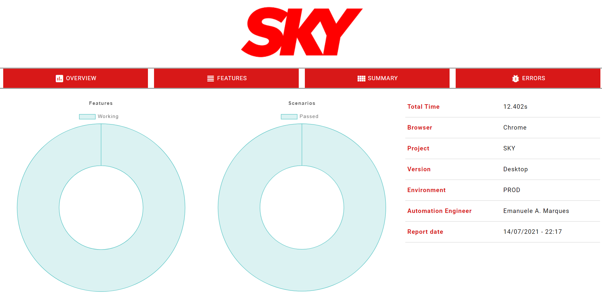

# [SKY]  QA Automação WEB

>Desafio técnico de automação web, com testes e2e

<p align="center">
  
</p>


---

### Fluxo ✨

- Acessar a categoria **Programação**
- Acessar **Lista de Canais**
- Pesquisar por um **Canal** e verificar se o mesmo aparece na listagem

---

### Validações 🔎

- Ao selecionar **Programação**, é validado se a página é realmente da categoria selecionada
- Ao pesquisar por um canal, é validade se o resultado corresponde ao que foi buscado, em todo array de resultado.
- Desenvolvido o método `greenify` para destacar as interações na aplicação
---

### Stack 🚀
- Ruby: linguagem de fácil entendimento, com uma baixa curva de aprendizado. Tem suporte para automações WEB, API e Mobile (utilizando appium);
- Capybara: DSL com suporte integrado ao Selenium;
- Cucumber: suporta implementação de especificações em formato estruturado usando Gherkin [aqui estamos inserindo o BDD :)];
- Report: foi gerado um report utilizando a gem `report_builder`, com customizações em um arquivo CSS com cores e logo da empresa;
- Page Objects Model: utilizando poderes da orientação a objetos como abstração, encapsulamento e segmentação de responsabilidades, temos um ganho na organização e reaproveitamento de código nas páginas;
- Site Prism: gem para melhorar a implementação do Page Objects Model;
- Selenium Webdriver: gem que possibilita as interações através do chromedriver com o navegador;
- Rspec: gem que possibilita usar asserções de forma mais intuitiva;
- CSS Selector: além de ter maior compatibilidade que o xpath nos navegadores, quando usado de forma correta, evita que alterações em outros elementos impactem no elemento mapeado.
---

### Pré-requisitos ⚡


- [Git](https://git-scm.com) [baixar última versão estável]
- [Ruby](https://rubyinstaller.org/downloads) [baixar a versão recomendada (2.7.2)]
- [Chromedriver](https://chromedriver.chromium.org/downloads) [baixar a de acordo com a versão do navegador]

---

### Instalação ⚙️

- Git\
Instalação padrão
- Ruby\
Instalação padrão
- Chromedriver\
Descompactar e inserir o arquivo `chromedriver.exe` dentro da pasta bin, no diretório de instalação do Ruby
- Bundler\
Rodar o seguinte comando para atualização do bundler: `gem install bundler`
- Gems utilizadas\
Com o repositório devidamente clonado, entrar no diretório raiz do projeto com o terminal e rodar o seguinte comando para instalação das gems do projeto: `bundle install`

---

### Como rodar a automação 🔥

Com as gems instaladas, ainda dentro do diretório raiz do projeto, executar o comando:
```bash
bundle exec cucumber -t @buscar_canal
```

### Reports 📂

Ao finalizar a execução, o report HTML `sky-automation-report` será gerado na pasta `reports`.
